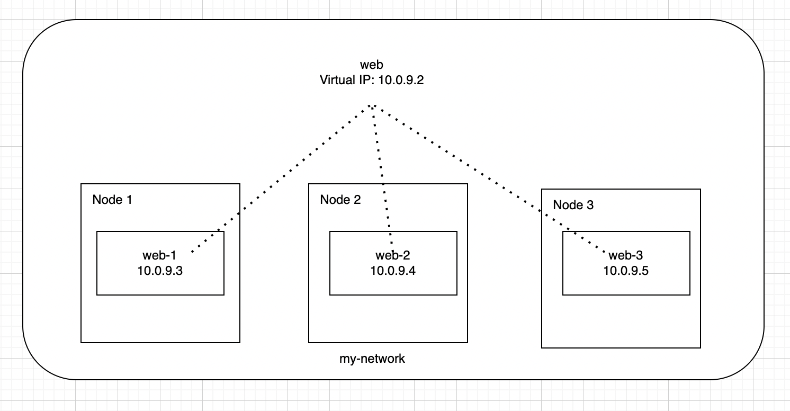
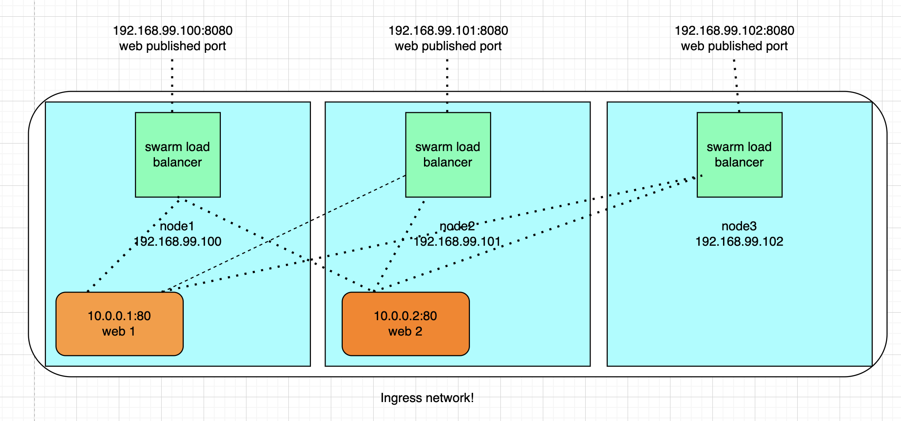
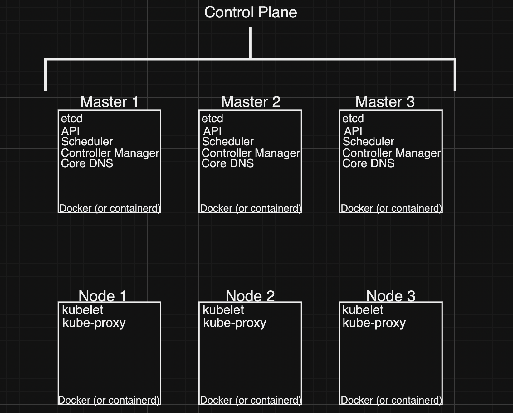

# Docker, Kubernetes and Swarm Crib Sheet

# Docker
Play with Docker: https://labs.play-with-docker.com/
Docker hub: https://hub.docker.com/
Docker docs: https://docs.docker.com/
Dockerfile reference: https://docs.docker.com/engine/reference/builder/
Docker compose file reference: https://docs.docker.com/compose/compose-file/
Docker swarm mode: https://docs.docker.com/engine/swarm/
Docker swarm mode key concepts: https://docs.docker.com/engine/swarm/key-concepts/
Docker swarm mode tutorial: https://docs.docker.com/engine/swarm/swarm-tutorial/

History: https://en.wikipedia.org/wiki/Docker_(software)

### What is Docker?

- Docker is a platform for building, running and shipping applications
- Docker is a container platform
- Docker is a tool designed to make it easier to create, deploy, and run applications by using containers
- Docker is a tool that allows developers, sys-admins etc. to easily deploy their applications in a sandbox (called containers) to run on the host operating system i.e. Linux
- Docker is a tool that can package an application and its dependencies in a virtual container that can run on any Linux server
- Docker is a tool that allows you to run your application in a virtual container
- Docker is a tool that allows you to package your application and its dependencies in a virtual container that you can run on any Linux server
- Docker is a tool that allows you to run your application in a virtual container that you can run on any Linux server

### Why use Docker?

- Docker enables you to separate your applications from your infrastructure so you can deliver software quickly
- With Docker, you can manage your infrastructure in the same ways you manage your applications
- By taking advantage of Docker's methodologies for shipping, testing, and deploying code quickly, you can significantly reduce the delay between writing code and running it in production
- Docker enables you to separate your applications from your infrastructure so you can deliver software quickly
- With Docker, you can manage your infrastructure in the same ways you manage your applications
- By taking advantage of Docker's methodologies for shipping, testing, and deploying code quickly, you can significantly reduce the delay between writing code and running it in production

### Docker commands
`docker run -d -p 8800:80 httpd` # Run httpd container in background and map port 80 to 8800

Output: (downloads layers of image and runs container, creates networking, empty file system, etc)
``` Unable to find image 'httpd:latest' locally
``` Unable to find image 'httpd:latest' locally
latest: Pulling from library/httpd
d121f8d1c412: Pull complete
a3ed95caeb02: Pull complete
a3ed95caeb02: Pulling fs layer
a3ed95caeb02: Verifying Checksum
Digest: sha256:3c7d1b7a266e7a6d6b2c5b5bdc4c0a0d5b6a1a6c0f1e9a3e8c1e1a4b7b6b7b6b
Status: Downloaded newer image for httpd:latest
a3ed95caeb02: Pull complete
```

- `docker container run --publish 80:80 nginx` - run nginx container in foreground and map port 80 to 80

- `docker container run --publish 80:80 --detach nginx` - run nginx container in background and map port 80 to 80

- `docker container run --publish 80:80 --detach --name webhost nginx` - run nginx container in background and map port 80 to 80 and name it webhost

- `docker container ls` - list running containers

- `docker container ls -a` - list all containers

- `docker container stop <container id>` - stop container   

- `docker container rm <container id>` - remove container

- `docker container rm -f <container id>` - remove container even if it is running

- `docker logs <container id>` - show logs of container

- `docker container top <container id>` - show running processes in container

### Docker Ubuntu vs Alpine vs Centos vs Debian vs Fedora vs Oracle Linux vs Red Hat Enterprise Linux vs SUSE Linux Enterprise Server

Ubuntu: https://hub.docker.com/_/ubuntu
Alpine: https://hub.docker.com/_/alpine
Centos: https://hub.docker.com/_/centos
Debian: https://hub.docker.com/_/debian
Fedora: https://hub.docker.com/_/fedora
Oracle Linux: https://hub.docker.com/_/oraclelinux
Red Hat Enterprise Linux: https://hub.docker.com/_/rhel
SUSE Linux Enterprise Server: https://hub.docker.com/_/suse

- Ubuntu is the most popular Linux distribution for running Docker containers. It is the most similar to Debian.
- Alpine is the most lightweight Linux distribution for running Docker containers. It is the most secure Linux distribution.
- Centos is the most popular Linux distribution for running Docker containers. It is the most similar to Red Hat Enterprise Linux.
    - Centos tends to lag behind Red Hat Enterprise Linux in terms of updates
- Debian is the most popular Linux distribution for running Docker containers. It is the most similar to Ubuntu.
- Fedora is the most popular Linux distribution for running Docker containers. It is the most similar to Red Hat Enterprise Linux.
- Oracle Linux is the most popular Linux distribution for running Docker containers. It is the most similar to Red Hat Enterprise Linux.
- Red Hat Enterprise Linux is the most popular Linux distribution for running Docker containers. It is the most similar to Centos.
- SUSE Linux Enterprise Server is the most popular Linux distribution for running Docker containers. It is the most similar to Red Hat Enterprise Linux.

### Docker Proces Monitoring

#### Commands for process monitoring
- `docker container top <container id>` - show running processes in container
- `docker container inspect <container id>` - show metadata about container (including process ID)
- `docker container stats` - show live performance stats for all containers

#### Commands for process management
- `docker system df` - show docker disk usage
- `docker system events` - show docker system events
- `docker system info` - show docker system info
- `docker system prune` - remove all unused containers, networks, images (both dangling and unreferenced), and optionally, volumes

### Getting inside a container

- `docker container run -it <container id> <command>` - run additional command in new container
- `docker container exec -it <container id> <command>` - run additional command in existing container

- `docker container run -it --name proxy nginx bash` - run nginx container in background and map port 80 to 80 and name it webhost
- `docker container exec -it <container id> bash` - run bash in existing container

- `docker container run -it --name ubuntu ubuntu` - run ubuntu container in background and map port 80 to 80 and name it webhost
    - `apt-get update` - update ubuntu
    - `apt-get install curl` - install curl

- `docker container exec -it <container id> bash` - run bash in existing container
- `docker container run -it alpine sh` - run bash in new container (alpine is a lightweight Linux distribution does not come with bash by default, so use sh instead of bash or install bash with `apk add bash`)

### Docker Networking

- `docker container port <container id>` - show port mapping of container
- `docker container inspect --format '{{ .NetworkSettings.IPAddress }}' <container id>` - show IP address of container
- `docker network ls` - list networks
- `docker network inspect <network id>` - show metadata about network
- `docker network create <network name>` - create network
- `docker network connect <network name> <container id>` - connect container to network
- `docker network disconnect <network name> <container id>` - disconnect container from network

Tips for networking in Docker containers (best practices):
- Each container should have only one concern
- Create your apps so frontend/backend sit on same Docker network
- Their inter-communication never leaves host
- All externally exposed ports closed by default
- You must manually expose via -p, which is better default security
- This gets even better with Docker Swarm and Overlay networks

#### Docker Networking: DNS

- You cannot rely on IP addresses to communicate between containers
- Use Docker DNS to allow containers to resolve each other by name
- Docker daemon has a built-in DNS server that containers use by default
- Try this: `docker container run -d --name my_nginx --network my_app_net nginx`
    - Ping the DNS: `docker container exec -it my_nginx ping new_nginx`
- Linking containers is a legacy feature
    - DNS is now the preferred method of inter-communication
    - Linking still works, but is not recommended
    - Linking may be removed in future versions of Docker

#### Docker Networking: DNS Round Robin Test

- Round Robin DNS is a technique of load distribution, load balancing, or fault-tolerance provisioning multiple, redundant Internet Protocol service hosts, e.g., Web server, FTP servers, by managing the Domain Name System's (DNS) responses to address requests from client computers according to an appropriate statistical model.
- Multiple containers can resolve to the same DNS name, and Docker will load balance requests between them

- Create a network: `docker network create dude`
- Run 2 containers: `docker container run -d --net dude --net-alias search elasticsearch:2`
- Run 2 containers: `docker container run -d --net dude --net-alias search elasticsearch:2`
- Run 1 container: `docker container run --rm --net dude alpine nslookup search` # Should return 2 IP addresses
- Run 1 container: `docker container run --rm --net dude centos curl -s search:9200` # Should return html

Example:
- `docker container run -p 80:80 --name webhost -d nginx` - run nginx container in background and map port 80 to 80 and name it webhost
- `docker container port webhost` - show port mapping of container
- `docker container inspect --format '{{ .NetworkSettings.IPAddress }}' webhost` - show IP address of container

### Docker Images

- `docker image ls` - list images
- `docker image history <image id>` - show history of image
- `docker image inspect <image id>` - show metadata about image
- `docker image tag <image id> <new image name>` - tag image
- `docker image build -t <image name> .` - build image from Dockerfile
- `docker image push <image name>` - push image to Docker hub
- `docker image pull <image name>` - pull image from Docker hub

### Dockerfile

- `docker image build -t <image name> .` - build image from Dockerfile

Example:
```
FROM nginx:latest
WORKDIR /usr/share/nginx/html
COPY index.html index.html
```

Dockerfile commands:
- FROM - base image
- LABEL - metadata
- RUN - run command in container
- COPY - copy files from host to container
- ADD - copy files from host to container (can also download files from internet)
- CMD - run command when container starts
- EXPOSE - expose port when container starts
- ENV - set environment variable
- ENTRYPOINT - run command when container starts (preferred over CMD)
- VOLUME - create mount point and mark as holding externally mounted volumes from native host or other containers
- USER - set user name or UID
- WORKDIR - set working directory
- ARG - define build-time variable
- ONBUILD - adds trigger instruction when image is used as the base for another build
- STOPSIGNAL - sets the system call signal that will be sent to the container to exit
- HEALTHCHECK - tells Docker how to test a container to check that it is still working
- SHELL - override default shell

### Docker Compose

- Why use Docker Compose?
    - configure relationships between containers
    - save our docker container run settings in easy-to-read file
    - create one-liner developer environment startups
    - Compose is great for local development, test and CI workflows
    - Staging and production deployments
    - Swarm and Kubernetes

- Difference between Docker Compose and Dockerfile:
    - Dockerfile is used to build images
    - Docker Compose is used to run containers

- Difference between Docker Compose and Docker Swarm:
    - Docker Compose is for local development
    - Docker Swarm is for production deployments

- `docker compose up` - start container
- `docker compose up -d` - start container in background
- `docker compose down` - stop container
- `docker compose down --rmi local` - stop container and remove image

- `docker compose ps` - list containers
- `docker compose top` - show running processes in container
- `docker compose logs` - show logs of container

- `docker compose build` - build image from Dockerfile (e.g. /docker-compose.yml)
- `docker compose push` - push image to Docker hub

- `docker compose config` - validate and view the compose file

- `docker compose up -d --scale <service name>=<number of containers>` - start container in background and scale number of containers

- docker-compose.yml:
```
version: '3.1'

services:
  web:
    image: nginx:latest
    ports:
      - 80:80
    volumes:
      - ./html:/usr/share/nginx/html
    networks:
      - webnet
  redis:
    image: redis:latest
    networks:
      - webnet
networks:
    webnet:
``` 
    - compose yaml syntax: https://docs.docker.com/compose/compose-file/compose-file-v3/

### Docker persistent data

- Two ways to deal with persistent data:
    - Volumes
    - Bind mounts

- Volumes:
    - Make special location outside of container UFS
    - Used for databases
    - When the container is removed, the volume still exists
    - Volumes can be shared and reused among containers
    - Changes to a volume are made directly
    - Changes to a volume will not be included when you update an image
    - Volumes persist until no containers use them
    - Volumes are the best way to persist data in Docker

    - In dockerfile:
        - `VOLUME /var/lib/mysql` - create volume in container, where the volume is stored on the host machine (in this case, the volume is stored in /var/lib/docker/volumes/ on the host machine)

    - Docker volume commands:
        - `docker volume ls` - list volumes
        - `docker volume inspect <volume name>` - show metadata about volume
        - `docker volume create <volume name>` - create volume
        - `docker volume rm <volume name>` - remove volume
        - `docker volume prune` - remove all unused volumes
        - `docker container run -d --name mysql -e MYSQL_ALLOW_EMPTY_PASSWORD=True -v mysql-db:/var/lib/mysql mysql` - create mysql container with named volume mysql-db

- Bind mounts:
    - Link container path to host path
    - Used for development
    - When the container is removed, the bind mount is removed
    - Changes to a bind mount are immediately visible on the host
    - Changes to a bind mount will not be included when you update an image
    - Bind mounts persist until you delete them

### Bind mounts - local files and running apps on containers

- `docker container run -d --name nginx -p 80:80 -v $(pwd):/usr/share/nginx/html nginx` - create nginx container with bind mount (pwd is the current directory) (this command will not work on Windows)

### How to upgrade a database and keep data persistent

- Create a named volume: `docker volume create postgres-db`
- `docker container run -d --name postgres -v postgres-db:/var/lib/postgresql/data postgres:13-bullseye` - create postgres container with named volume postgres-db
- `docker logs postgres` - show logs of postgres container
- `docker stop postgres` - stop postgres container
- `docker container run -d --name postgres-new -v postgres-db:/var/lib/postgresql/data postgres:13.11-bullseye` - create postgres-new container with named volume postgres-db
- `docker logs postgres-new` - show logs of postgres-new container
- `docker stop postgres-new` - stop postgres-new container

### File permissions across multiple containers

- use ps aux to find out the user id of the process running in the container
- find uid/gid of user in container: `etc/passwd` (uid:gid) and `etc/group` (gid) files to find out the uid/gid of the user running the process in the container
- find uid/gid if both containers are running with the matching user ID (uid) and group ID (gid)
- if the uid/gid of the user running the process in the container does not match the uid/gid of the user running the process in the container, then you will need to change the uid/gid of the user running the process in the container to match the uid/gid of the user running the process in the container
- dockerfile:
```
FROM nginx:latest
RUN groupadd --gid 1000 node \\
    && useradd --uid 1000 --gid node --shell /bin/bash --create-home node
USER 1000:1000
```
- Tip setting up Dockerfiles USER with numbers works better than names in Kubernetes

### Keeping Docker system clean

- `docker container prune` - remove all stopped containers (both dangling and unreferenced)
- `docker image prune` - remove unused images (both dangling and unreferenced)
- `docker system prune` - remove all unused data (including unused images)
- `docker system prune -a` - remove all unused data (including unused images)


### Docker logging

stdout and stderr are the output streams from a Linux process. By default, stdout and stderr are output to the console (your terminal window) where you started the process. You can redirect stdout and stderr to a file by using the > and 2> redirect symbols respectively.

### Docker install/config

#### Commands

- `docker version` - check docker version (client and server)
- `docker info` - check docker info (including storage driver)
- `docker` - list docker commands (including swarm commands)
   - Management Commands:
      - `docker container` - manage containers
      - `docker image` - manage images
      - `docker network` - manage networks
      - `docker node` - manage swarm nodes
      - `docker plugin` - manage plugins
      - `docker secret` - manage secrets
      - `docker service` - manage services
      - `docker stack` - manage Docker stacks
      - `docker swarm` - manage swarm
      - `docker system` - manage Docker
      - `docker volume` - manage volumes

### What is a container?

A container is a process or group of processes that are isolated from the rest of the system. It has its own file system, networking, etc. It is a process that is running on the host machine.

- Containers are not VMs
- Containers are restricted processes (restricted by Linux kernel)
   - This is why Docker Desktop uses lightweight Linux VM to run containers on Windows and Mac

- `ps aux` - list all processes running on host machine

- Nginx (web server) is a container that runs on the host machine
    - https://www.nginx.com/resources/glossary/nginx/ (open source software for web serving, reverse proxying, caching, load balancing, media streaming, and more)

### What is image?

An image is a file that contains all the dependencies and configuration required to run a container. It is a read-only template with instructions for creating a Docker container.

- Images are not containers
- Images are not VMs
- Images are not processes
- Images are not files
- Images are not directories

- Nginx (web server) is an image that can be used to create a container
    - https://hub.docker.com/_/nginx

### What happens when you run a container?

1. Docker client sends a request to Docker daemon
2. Docker daemon checks if image exists locally
3. If image does not exist locally, Docker daemon downloads image from Docker hub
4. Docker daemon creates container based on image
5. Gives container a virtual IP on a private network inside docker engine
6. Opens up port on host and forwards to port in container
7. Starts container by using the CMD in the image Dockerfile

# Docker Swarm - orchestration

#### Managing multiple containers the problems:

- How do we automate container lifecycle?
- How do we scale containers horizontally?
- How do we ensure containers are re-created if they fail?
- How do we ensure containers are running on all nodes?
- How do we ensure the right containers are running on the right nodes?
- How can we replae containers without downtime (blue/green deployment)?
- How can we control/track where containers get started?
- How can we create cross-node virtual networks?
- How can we ensure only trusted servers run our containers?
- How can we store secrets, keys, passwords and get them to the right container when it needs it?

#### What is Docker Swarm?

- Swarm is Docker's orchestration tool
- Swarm is built inside Docker
- Swarm is a clustering and scheduling tool for Docker containers
- Swarm is the native clustering engine for Docker
- Swarm is a group of Docker engines running in swarm mode
- Not enabled by default, new commands when enabled
    - `docker swarm` - manage swarm
    - `docker node` - manage swarm nodes
    - `docker service` - manage services
    - `docker stack` - manage Docker stacks
    - `docker secret` - manage secrets
    - `docker config` - manage Docker configs

#### Docker Swarm - manager nodes:

- Manager nodes are responsible for maintaining the desired state of the swarm
- Manager nodes elect a leader to conduct orchestration tasks
- Manager nodes maintain the cluster state
- Manager nodes schedule services
- Manager nodes serve as the swarm HTTP API endpoints
- Manager nodes enforce policies
- Manager nodes encrypt/decrypt secrets
- Manager nodes are the only nodes where you can run `docker swarm` commands

#### Docker Swarm - worker nodes:

- Worker nodes receive and execute tasks dispatched from manager nodes
- Worker nodes run containers and services
- Worker nodes report back to manager nodes

Docker swarm commands:
- `docker info` - check if swarm is active
- `docker swarm init` - initialize swarm
- `docker node ls` - list nodes in swarm
- `docker service create alpine ping 8.8.8.8` - create service
- `docker service ls` - list services
- `docker service ps <service name>` - list tasks in service
- `docker service update <service name> --replicas <number of replicas>` - update service
- `docker service ls` - list services (replicas column shows number of replicas)
- `docker service ps <service name>` - list tasks in service (desired state column shows number of replicas)
- `docker update --help` - show help for update command (e.g. `docker service update --help`, this command shows help for service update command)

#### Docker Swarm - Creating 3 Node Swarm Cluster

- Create 3 VMs (e.g. using VirtualBox)
- Install Docker on each VM (e.g. `curl -fsSL https://get.docker.com -o get-docker.sh` and `sudo sh get-docker.sh`)
- Initialize swarm on one VM (e.g. `docker swarm init --advertise-addr` and `docker swarm join-token`)
- Join other VMs to swarm as worker nodes e.g. `docker swarm join --token SWMTKN-xxxx `
- Run `docker node ls` on manager node to verify swarm is active
- Run `docker node update --role manager <node id>` on manager node to promote worker node to manager node
- Run `docker swarm join-token manager` on manager node to get join token for manager node

Test: `curl localhost:8800` # Should return html

##### Docker Swarm - Overlay Networking

- Overlay networking is a built-in docker network driver
- Overlay networking enables multi-host communication
- Overlay networking requires a key-value store
- Overlay networking requires a routing mesh
- Overlay networking is the default network driver for swarm services
- Overlay networking is the best way to network containers across multiple hosts

- `docker network create --driver overlay <network name>` - create overlay network
- `docker service create --name <service name> --network <network name> <image name>` - create service with overlay network
- `docker service ls` - list services
- `docker service ps <service name>` - list tasks in service
- `docker container logs <container id>` - show logs of container

##### Docker Swarm - if I created a new swarm service and we had 3 replicas and it created 3 tasks with 3 containers on 3 nodes

- Inside that overlay network, it creates a virtual IP that is mapped to the dns name of the service
- The "web" will load balance between the 3 containers
- This is not DNS round robin, this is a virtual IP that is mapped to the dns name of the service
- The benefits over DNS round robin is that it is faster



##### Docker Swarm - Example 2 - of external traffic hitting the load balancer

- Similar to (Docker Networking: DNS Round Robin Test section)
- Here we are creating one service called `web` and it created two tasks and applied them to different two nodes, each one of the nodes has a built in load balancer on the external ip address
- Any traffic that hits port 8080 on any of these 3 nodes, the load balancer will load balance between the container whether this is on a local node or a remote node (this all happens in the background)
- This is not DNS round robin, this is a virtual IP that is mapped to the dns name of the service



Lets see the routing mesh in action:

- `docker service create --name search --replicas 3 -p 9200:9200 elasticsearch:2` (elasticsearch is a search engine)
- `docker ps search` (3 containers running on 3 different nodes)
- `curl localhost:9200` (curl the load balancer on any node and it will load balance between the 3 containers)

#### Docker Swarm - Routing Mesh

- Routing mesh routes ingress (incoming) packets for a Service to proper Task
- Routing mesh routes packets on a Service's published ports
- Routing mesh routes packets for a Service to proper Node
- Routing mesh uses IPVS from Linux kernel

Limitations:
- This is a stateless load balancer
- This load balancer is at layer 3 (TCP), not layer 4 (DNS)

How to get around this limitation:
- Use a layer 7 load balancer (e.g. HAProxy, Nginx, Traefik, etc)
- Docker Enterprise Edition has a built-in L4 web proxy

#### Docker Swarm - Create a multi-service multi-node app

- Using Docker's distributed voting app
- 1 volume, 2 networks, 5 services required

##### Services:

- vote
    - dockersamples/examplevotingapp_vote:before
    - web front-end
    - port 80 (TCP) (published)
    - 2 replicas
    - network: front-tier
- redis
    - redis:alpine
    - in-memory database (key-value store)
    - no public ports
    - 2 replica
    - network: front-tier
- worker
    - dockersamples/examplevotingapp_worker
    - backend processor for redis and postgres
    - no public ports
    - 1 replica
    - network: front-tier, back-tier
- db
    - postgres:9.4
    - one named volume, pointing to /var/lib/postgresql/data
    - no public ports
    - 1 replica
    - network: back-tier
- result
    - dockersamples/examplevotingapp_result:before
    - web front-end for results (admin)
    - port 80 (TCP) (published)
    - 1 replica
    - network: back-tier

##### Docker Swarm - Step by step through this design:

- Create overlay networks:
    - `docker network create --driver overlay front-tier`
    - `docker network create --driver overlay back-tier`

- Create service vote:
    - `docker service create --name vote --replicas 2 --network front-tier -p 80:80 dockersamples/examplevotingapp_vote:before`
    - `docker service create --name redis --replicas 1 --network front-tier redis:alpine`
    - `docker service create --name worker --replicas 1 --network front-tier --network back-tier dockersamples/examplevotingapp_worker`
    - `docker service create --name db --replicas 1 --network back-tier -mount type=volume,source=db-data,target=/var/lib/postgresql/data postgres:9.4`
    - `docker service create --name result --replicas 1 --network back-tier -p 5001:80 dockersamples/examplevotingapp_result:before`

- Test:
    - `docker service ls` (5 services)
    - `docker service ps <service name>` (5 services)
    - `docker service logs <service name>` (5 services)
    - `curl localhost:80` (vote)
    - `curl localhost:5001` (result)

#### Docker Swarm - Stacks

- Stacks are a group of interrelated services that share dependencies, and can be orchestrated and scaled together
- Stacks are the next evolution of Docker Compose
- Stacks are the best way to deploy a multi-service app to Docker Swarm
- Stacks are written in YAML (just like Docker Compose files)
- Stacks are deployed using `docker stack deploy` command
- Stacks are the future of multi-service deployments in Docker

example file: swarm-examples/example-voting-app.yml

##### Step by step through Stacks:

- `docker stack deploy -c example-voting-app.yml vote` - deploy stack
- `docker stack ls` - list stacks
- `docker stack ps <stack name>` - list tasks in stack
- `docker stack services <stack name>` - list services in stack
- `docker network ls` - list networks
- `docker stack rm <stack name>` - remove stack

#### Docker Swarm - Secrets

- Secrets are how we manage sensitive data and passwords in Docker
- Secrets are encrypted during transit and at rest in Docker Swarm
- Secrets are only accessible to the containers that need them
- Secrets are stored in an encrypted Raft log in Docker Swarm
- Secrets can be added and removed from services while they are running
- Secrets are never saved to disk, even on manager nodes
- Secrets are only stored in memory on manager nodes
- Secrets are never sent to the Docker daemon
- Secrets are only sent over the Raft log to other manager nodes
- Secrets are only stored in memory on worker nodes
- Secrets are never written to disk on worker nodes
- They look like files in the container file system (but they are actually in memory) (e.g. /run/secrets/<secret_name>) or (e.g. /run/secrets/<secret_alias>)
- Local Docker Compose can use file-based secrets (not encrypted - not recommended for production)

##### Docker Swarm - Step by step through Secrets:

- `docker secret create psql_user psql_user.txt` - create secret
- `echo "testPwd" | docker secret create psql_pwd -` - create secret (from stdin)
- `docker secret ls` - list secrets
- `docker secret inspect psql_user` - show metadata about secret
- `docker service create --name psql --secret psql_user --secret psql_pwd -e POSTGRES_PASSWORD_FILE=/run/secrets/psql_pwd postgres` - create service with secrets
- `docker service ps psql` - list tasks in service
- `docker exec -it <container id> bash` - run bash in container
- `cat /run/secrets/psql_user` - show secret in container

##### Docker Swarm - Step by step through Stacks and Secrets:

example file: swarm-examples/example-voting-app-secrets.yml

- `docker stack deploy -c example-voting-app-secrets.yml vote` - deploy stack
- `docker stack rm vote` - remove stack

How to use secrets in Docker Compose:

- `docker-compose.yml`:
```
version: '3.1'

services:
  psql:
    image: postgres
    environment:
      POSTGRES_PASSWORD_FILE: /run/secrets/psql_pwd
    secrets:
      - psql_user
      - psql_pwd
secrets:
    psql_user:
        file: ./psql_user.txt
    psql_pwd:
        file: ./psql_pwd.txt
```

##### Docker Swarm - Full app life cycle Dev Build and Deploy with a single Compose File

File Structure:

docker-compose.override.yml - (overrides the docker-compose.yml file) (e.g. `docker-compose -f docker-compose.yml -f docker-compose.override.yml up`
docker-compose.prod.yml - (for production only) (e.g. `docker stack deploy -c docker-compose.prod.yml`)
docker-compose.test.yml - (for testing only) (e.g. `docker-compose -f docker-compose.test.yml up --abort-on-container-exit`)
docker-compose.yml - (for local dev, testing, and production) (e.g. `docker-compose up`)
Dockerfile - (for building images) (e.g. `docker image build -t <image name> .`)
psql_pwd.txt` - (for secrets) (e.g. `echo "testPwd" | docker secret create psql_pwd -`)


##### Docker Swarm - Service Updates and Rollbacks

- `docker service update --help` - show help for update command (e.g. `docker service update --help`, this command shows help for service update command)
- `docker service update --image <image name> <service name>` - update service
- `docker service update --rollback <service name>` - rollback service
- `docker service update --force <service name>` - force update service
- `docker service update --update-parallelism <number of replicas> <service name>` - update service
- `docker service update --update-delay <number of seconds> <service name>` - update service (delay between updates)
- `docker service update --env-add <environment variable> <service name> --publish-rm 8080` - update service (add environment variable) (remove published port)
- `docker service scale <service name>=<number of replicas>` - scale service

##### Docker Swarm - healthcheck in Dockerfile

- `docker run --health-cmd="curl -f localhost:9200/_cluster/health || false" --health-interval=5s --health-retries=3 --health-timeout=2s --health-start-period=15s elasticsearch:2` - run elasticsearch container with healthcheck

--health-cmd - command to run to check health
--health-interval - time between running the healthcheck
--health-retries - number of retries before marking unhealthy
--health-timeout - time to wait before marking unhealthy   
--health-start-period - time to wait before starting first healthcheck
--no-healthcheck - disable healthcheck

# Docker Container Registry: Image Storage and Distribution

##### What is a container registry?

- A container registry is a place to store and distribute container images
- A container registry is a collection of different Docker images with different versions
- A container registry is a place to store and distribute Docker images

##### Docker Hub

- Docker Hub is a public container registry
- Docker Hub is free to use
- Docker Hub is the default registry when you use `docker pull`
- Docker Hub is the world's largest container registry
- Docker Hub is the default registry for Docker Desktop
- Docker Hub is the default registry for Docker Cloud

##### Docker Store

- Docker Store is a public container registry
- Docker Store is free to use
- Docker Store is the place to find trusted and enterprise ready containers
- Docker Store is the place to find official images for Docker
- Docker Store is the place to find certified images for Docker
- Docker Store is the place to find plugins for Docker

##### Docker Cloud

- Docker Cloud is a public container registry
- Docker Cloud is free to use
- Docker Cloud is the place to find trusted and enterprise ready containers
- Docker Cloud is the place to find official images for Docker
- Docker Cloud is the place to find certified images for Docker
- Docker Cloud is the place to find plugins for Docker

##### Docker Hub - set up automated builds

- https://docs.docker.com/docker-hub/builds/

- in Docker Hub, go to Create -> Create Automated Build
- select GitHub or Bitbucket
- select the repository
- select the branch
- select the Dockerfile location
- select Create

##### Docker Registry

- Docker Registry is an open source container registry
- Docker Registry is free to use (defacto standard for storing and distributing Docker images)
- Not as full featured as Docker Hub (no web UI, no user management, no organization management, etc)
- This is a web api that stores and distributes Docker images (written in Go)
- Storage drivers built in include: local, Amazon S3, Azure Blob Storage, Google Cloud Storage, OpenStack Swift, OpenS3, and more
- Docker Registry is the default registry for Docker EE
- Docker Registry is the default registry for Docker CE
- Docker Registry is the default registry for Docker EE Basic
- Docker Registry is the default registry for Docker EE Standard
- Docker Registry is the default registry for Docker EE Advanced
- github repository: github.com/docker/distribution (but your likely use docker registry image from Docker Hub)

- Secure Docker Registry with TLS and Authentication
    - https://docs.docker.com/registry/deploying/
- Storage clean up with garbage collection
    - https://docs.docker.com/registry/garbage-collection/
- enable hub caching via "--registry-mirror" (can be used to cache images from Docker Hub)
    - https://docs.docker.com/registry/recipes/mirror/

##### Docker Registry - set up

- `docker container run -d -p 5000:5000 --name registry registry` - run registry container
- `docker container ls` - list containers
- 'docker run hello-world` - run hello-world container
- `docker image tag hello-world localhost:5000/hello-world` - tag hello-world image
- `docker image ls` - list images
- `docker image push localhost:5000/hello-world` - push hello-world image to registry
- `docker container stop registry` - stop registry container
- `docker container rm registry` - remove registry container
- `docker container run -d -p 5000:5000 --name registry -v $(pwd)/registry-data:/var/lib/registry registry` - run registry container with volume
- `docker image push localhost:5000/hello-world` - push hello-world image to registry
- `ll registry-data/docker/registry/v2/repositories/` - list images in registry
- `tree registry-data/docker/registry/v2/repositories/` - list images in registry

##### Docker Registry - with Swarm

- Swarm is a built-in Docker registry
- Swarm is a built-in Docker registry that is not secure by default
- Swarm is a built-in Docker registry that is not recommended for production
- Recommended to use Docker Registry or Docker Trusted Registry for production (AWS ECR, Azure Container Registry, Google Container Registry, etc) https://github.com/veggiemonk/awesome-docker

- `docker service create --name registry --publish published=5000,target=5000 registry` - create registry service
- `docker service ls` - list services
- `docker service ps registry` - list tasks in service
- `docker image tag hello-world localhost:5000/hello-world` - tag hello-world image
- `docker image push localhost:5000/hello-world` - push hello-world image to registry
- `docker service rm registry` - remove registry service

- Registry and proper TLS
    - "Secure by default" is a core principle of Docker
    - Except, local registries are not secure by default

##### Docker in Production Tips

Reduce Scope
- Many initial production deployments are small
- Solution you don't need on day one:
    - Full CI/CD pipeline
    - Dynamic scaling
    - Containerising all or nothing
    - Starting with persistent data (databases and volumes)
    - Starting with complex networking (overlay networks, etc)

Legacy Apps
- Microservice conversion is not required
- 12 factor apps is something to strive for but not required
- Don't let idealism get in the way of containerisation

What to focus on first: Dockerfiles
- More important than Docker Compose or Swarm (fancy orchestration)
- Its your new build environment documentation
- Understand the Dockerfile/ENTRYPOINT 
- FROM Offical distros (e.g. Debian, Ubuntu, CentOS, etc)

Dockerfile Maturity Model
- Make it start
- Make it log all things (stdout/stderr)
- Make it documented in file
- Make it work for all environments (dev, test, prod)
- Make it lean (small as possible) (e.g. use alpine) - but at the start don't worry about this
- Make it secure (e.g. no root, no secrets, etc)
- Make it scale (e.g. no state, no sessions, etc)

Dockerfile Anti-Pattern: Trapping Data
- Problem: Store unique data in container
- Solution: Define VOLUME for each location
```
VOLUME /var/lib/postgresql/data
ENTRYPOINT ["docker-entrypoint.sh"]
CMD ["postgres"]
```
- (Sometimes people forget to define extra volumes for their data such as debug logs or dump logs, or cache files, etc) You want to make sure these are in volumes.

- Don't use the latest tag in production

Dockerfile Anti-Pattern: Default configs

- Not changing default configs (or copying VM configs)
- Solution: Update default configs via ENV, RUN, ENTRYPOINT (ran before CMD), or CMD

Dockerfile Anti-Pattern: Environment specific 

- Problem: Copying files values on image build
- Solution: Single dockerfile, with default values, ENV for overrides using ENTRYPOINT script 

Containers on VMs or Bare Metal?

- Loads of pros and cons for both: (stick with what your comfortable with first)
    - Containers on VMs
        - Pros:
            - Easy to get started
            - Easy to scale
            - Easy to migrate
            - Easy to secure
        - Cons:
            - Extra layer of abstraction
            - Extra resource overhead
            - Extra cost
            - Extra complexity
            - Extra management

    - Containers on Bare Metal
        - Pros:
            - No extra layer of abstraction
            - No extra resource overhead
            - No extra cost
            - No extra complexity
            - No extra management
        - Cons:
            - Hard to get started
            - Hard to scale
            - Hard to migrate
            - Hard to secure

- VMs vs Bare Metal on performance:
    - whitepaper on this can be found here: https://www.bretfisher.com/dockercon17eu/

Why OS Linux Distro Matters?

- Docker is kernal and storage driver dependent
- Miniman version of Linux is not always best
- No opion? use Ubuntu LTS
    - Well tested and suportted
    - Wide storage driver support
    - Or try InfraKit or LinuxKit
- Get the correct Docker for your distro from Docker docs
    - https://docs.docker.com/engine/installation/

Container Distro Which one?

- Don't choose based on size
- At first match your existing deployment process
- Perhaps later try a smaller distro like Alpine

Summary on Tips

- Trim your optional requirements
- Start with Dockerfiles or compose
- Watch out for anti-patterns in Dockerfiles
- Use a familiar distro
- Find a way to out source your plumbing (e.g. Docker Trusted Registry, etc)
- Realise parts of your tech stack may change (stay flexible)

# Kubernetes

- Kubernetes is an open source container orchestration tool
- Kubernetes = K8s
- Container orchestration is the automated process of managing and deploying containers
- Released by Google in 2015, now maintained by a large community of contributors
- Runs on top of Docker (usually) as a set of APIs in containers
- Provides API/CLI to manage clusters of containers
- Many cloud providers offer managed Kubernetes clusters (e.g. AWS EKS, Azure AKS, Google GKE, etc)
- Many vendors make distributions of Kubernetes (e.g. Docker EE, Red Hat OpenShift, Helm, etc)

## Why Kubernetes?

- Kubernetes is the most popular container orchestration tool
- Orchestration is the automated process of managing and deploying containers
- You might not need orchestration if you only have a few containers (you could just need Docker Compose / single node using features of AWS - Autoscaling groups, elastic load balancing, Azure, Google Cloud, etc)
- Servers + Change Rate = Need for Orchestration
- When your starting out you may only need a single server or a few servers or not changing apps much (orchestration can be overkill) using services like Elastic Beanstalk, Heroku, etc (alternatives of doing your own orchestration)
- If you choose K8s which distribution should you use? (e.g. Docker EE, Red Hat OpenShift, Helm, etc)

## Kubernetes vs Swarm

- Kuberenetes and Swarm are both container orchestration tools
- Swarm is built into Docker
- Kubernetes is not built into Docker
- Swarm is easier to setup and get started with
- Kubernetes has a larger ecosystem of tools and support

### Advantages of Kubernetes:
- Kubernetes has a larger ecosystem of tools and support
- Kubernetes has a larger community of users
- Kubernetes has a larger community of contributors
- Kubernetes has a larger ecosystem of tools and support
- Cloud Vendors will support Kubernetes - can manage it for you (e.g. AWS EKS, Azure AKS, Google GKE, etc)
- Covers more use cases (e.g. stateful apps, batch jobs, etc)

### Advantages of Swarm:
- Swarm is built into Docker
- Swarm is easier to setup and get started with
- Swarm is easier to manage
- Swarm has a smaller learning curve
- Secure by default
- Easier to troubleshoot

### Kubernetes - Architecture Terminology
- kubectl - Kubernetes CLI
- Node - a server in the Kubernetes cluster
- kubelet - Kubernetes agent that runs on each node in the cluster
- Control Plane - the master that controls the cluster
    - kube-apiserver - Kubernetes agent that runs on the master node in the cluster
    - kube-scheduler - Kubernetes agent that runs on the master node in the cluster
    - kube-controller-manager - Kubernetes agent that runs on the master node in the cluster
    - etcd - key-value store that stores the cluster state



- In a multi master set up, you have multiple control planes (e.g. 3 control planes)
    - odd number of control planes is recommended (e.g. 3, 5, 7, etc) RAFT protocol is used to elect a leader
    - if you have an even number of control planes, you can have a split brain problem (e.g. 2 control planes, one control plane goes down, the other control plane is not sure if the other control plane is down or not, so it will not take over the other control plane)
    
- kube-proxy - Kubernetes agent that runs on each node in the cluster
- kube-scheduler - Kubernetes agent that runs on the master node in the cluster
- kube-apiserver - Kubernetes agent that runs on the master node in the cluster

### Kubernetes - Container Orchestration

- Pod: one or more containers that are deployed together on one node
  - basic unit of deployment in Kubernetes - containers are always in a pod
- Controller: For creating/updating pods and other objects
  - ReplicaSet: ensures that a specified number of pod replicas are running at any given time
  - Deployment: manages ReplicaSets and provides declarative updates for Pods and ReplicaSets
  - DaemonSet: ensures that all (or some) Nodes run a copy of a Pod
  - StatefulSet: manages the deployment and scaling of a set of Pods, and provides guarantees about the ordering and uniqueness of these Pods
  - Job: creates one or more Pods and ensures that a specified number of them successfully terminate
  - CronJob: creates Jobs on a repeating schedule
- Service: For networking and load balancing of pods
  - Service: an abstract way to expose an application running on a set of Pods as a network service
  - Ingress: exposes HTTP and HTTPS routes from outside the cluster to services within the cluster
- Namespace: For scoping and isolating objects (filtering objects in Kubernetes)) 
  - Namespace: virtual clusters backed by the same physical cluster
- Secrets: For storing sensitive data
  - Secret: an object that contains a small amount of sensitive data such as a password, a token, or a key
- ConfigMaps: For storing configuration data
    - ConfigMap: an API object used to store non-confidential data in key-value pairs

### Kubernetes - Run, Create, Apply

- `kubectl run --help` - show help for run command (create and run a particular image, possibly replicated)
- `kubectl create --help` - show help for create command (create resources from files)
- `kubectl apply --help` - show help for apply command (create and update resources from files)

### Kubernetes - Kubectl Run Pod

Starter commands:

- `kubectl version` - check kubectl version (client and server)
- `kubectl version --short` (client and server)

Two ways to create a pod:
    - Imperative commands (e.g. `kubectl run my-nginx --image nginx`)
    - Declarative files (e.g. `kubectl apply -f nginx.yaml`)

Get the pods:
    - `kubectl get pods`

Get all resources:
    - `kubectl get all` (e.g. pods, services, deployments, etc)

Why do we need a pod?

- Unlike Docker, Kubernetes does not have a built-in container runtime
- Kubernetes uses a container runtime to run containers in pods
- Kubernetes supports multiple container runtimes (e.g. Docker, containerd, CRI-O, etc)
- You creat Pods (via CLI, YAML or API)
- kublet (agent on each node) creates containers (via container runtime)

Official K8 docs:

https://kubernetes.io/docs/reference/kubectl/cheatsheet/
https://kubernetes.io/docs/reference/kubectl/docker-cli-to-kubectl/

More K8 docs:
https://cheatography.com/deleted-44122/cheat-sheets/kubectl/
https://cheatography.com/gauravpandey44/cheat-sheets/kubernetes-k8s/

And use the `--help` flag on any command

### Kubernetes - Kubectl Create Deployment

- `kubectl create deployment --help` - show help for create deployment command (create a deployment with the specified name)
- `kubectl create deployment my-nginx --image nginx` - create deployment
- `kubectl get deployments` - get deployments
- `kubectl get all` - get all resources
- `kubectl get pods` - get pods

Instead of creating a pod, we created a deployment. A deployment is a higher level abstraction that manages pods for us. A deployment manages a ReplicaSet which manages pods.

Why do we need a deployment?

- A deployment is a higher level abstraction that manages pods for us
- A deployment manages a ReplicaSet which manages pods
- A deployment allows us to easily scale pods up or down
- A deployment allows us to easily update pods when a new image is pushed
- A deployment allows us to easily roll back changes to a previous version

### Clean up commands:

- `kubectl delete deployment <deployment name>` - delete deployment
- `kubectl delete pod <pod name>` - delete pod
- `kubectl delete all --all` - delete all resources

### Kubernetes - Scaling ReplicaSets

- `kubectl scale --help` - show help for scale command (set a new size for a Deployment, ReplicaSet, Replication Controller, or StatefulSet)
- `kubectl scale deployment <deployment name> --replicas <number of replicas>` - scale deployment

What happened when we scaled the deployment?

- A new ReplicaSet was created
- The new ReplicaSet created a new pod
- The old ReplicaSet was scaled down
- The old ReplicaSet deleted the old pod

### Kubernetes - Inspecting Resources

#### Inspecting resources with get

- `kubectl get --help` - show help for get command (display one or many resources)
- `kubectl get all` - get all resources
- `kubectl get pods` - get pods
- `kubectl get pods -o wide` - get pods (wide output)
- `kubectl get pods -o yaml` - get pods (yaml output)
- `kubectl get pods -o json` - get pods (json output)
- `kubectl get pods -o jsonpath` - get pods (jsonpath output)

- `-o yaml` - output yaml flag is useful for creating yaml files and then editing them and then applying them for a dev workflow

#### Inspecting resources with describe

This will give:
- Events
- Labels
- Annotations
- Status
- etc 

- `kubectl describe --help` - show help for describe command (show details of a specific resource or group of resources)
- `kubectl describe pod <pod name>` - describe pod
- `kubectl describe deployment <deployment name>` - describe deployment
- `kubectl describe service <service name>` - describe service
- `kubectl describe node <node name>` - describe node

#### Inspecting resources with watch

- `kubectl get pods -w` - get pods (watch)
- `kubectl get pods -w -o wide` - get pods (watch) (wide output)
- `kubectl get events -watch-only` - get events (watch only) -watch-only flag is useful for debugging (e.g. if you have a pod that is not starting up, you can run this command to see what is happening)

### Kubernetes - Inspecting logs

- `kubectl logs --help` - show help for logs command (print the logs for a container in a pod)
- `kubectl logs <pod name>` - show logs of pod
- `kubectl logs <pod name> -f` - show logs of pod (follow)
- `kubectl logs <pod name> --tail <number of lines>` - show logs of pod (tail)
- `kubectl logs <pod name> --since <time>` - show logs of pod (since)
- `kubectl logs <pod name> --timestamps` - show logs of pod (timestamps)
- `kubectl logs <pod name> --previous` - show logs of pod (previous) (e.g. if a pod has crashed, you can use this command to see the logs of the previous pod)
- `kubectl logs <pod name> --all-containers` - show logs of pod (all containers) (e.g. if you have multiple containers in a pod, you can use this command to see the logs of all the containers in the pod)
- `kubectl logs -l <label name>=<label value>` - show logs of pod (label selector) (e.g. if you have multiple pods with the same label, you can use this command to see the logs of all the pods with that label)
- stern (https://github.com/stern/stern) - multi pod/container log tailing (e.g. `stern <pod name>`)

### Exposing Kubernetes Ports

- `kubectl port-forward --help` - show help for port-forward command (forward one or more local ports to a pod)

#### Exposing Containers

- `kubectl expose --help` - show help for expose command (take a replication controller, service, deployment or pod and expose it as a new Kubernetes Service)
   - A service is a stable, IP address and port for accessing a set of pods
   - If we want to connect to pod(s), we need to expose them as a service
   - CoreDNS is a DNS server that resolves DNS names to IP addresses (e.g. if you have a service called my-service, you can use my-service as the hostname to connect to the service)
   - Types of services
        - ClusterIP (default) - Exposes the Service on an internal IP in the cluster. This type makes the Service only reachable from within the cluster.
        - NodePort - Exposes the Service on the same port of each selected Node in the cluster using NAT. Makes a Service accessible from outside the cluster using <NodeIP>:<NodePort>. Superset of ClusterIP.
        - LoadBalancer - Creates an external load balancer in the current cloud (if supported) and assigns a fixed, external IP to the Service. Superset of NodePort.
        - ExternalName - Exposes the Service using an arbitrary name (specified by externalName in the spec) by returning a CNAME record with the name. No proxy is used. This type requires v1.7 or higher of kube-dns.

#### Basic Service Types
- ClusterIP (default) 
    - single virtual IP address, only reachable from within the cluster
    - pods can reach service on apps port number
- NodePort
    - High port allocated on each node (e.g. 30000-32767)
    - Port is open on every node's IP
    - Anyone can connect (if they can reach the node)
    - other pods need to be updated to use NodePort
- LoadBalancer
    - Controls a Load Balancer endpoint external to the cluster
    - Only available when infrastructure provider gives you a load balancer (e.g. AWS ELB, Google Cloud Load Balancer, Azure Load Balancer)
    - Creates NodePort and ClusterIP services, tells LB to send to NodePort
- ExternalName
    - Adds CNAME DNS record to CoreDNS only (does not do proxying)
    - Requires CoreDNS v1.7 or higher
    - Not used for pods, but for giving pods a DNS name to use for something outside the cluster

#### Creating a ClusterIP Service

- Open a separate terminal window and run `kubectl get pods -w` (watch pods)
- `kubectl expose deployment <deployment name> --port <port number>` - expose deployment
- `kubectl scale deployment <deployment name> --replicas <number of replicas>` - scale deployment
- `kubectl expose deployment <deployment name> --port <port number>` - expose deployment

Example output of port:
    
    ```
    NAME         TYPE        CLUSTER-IP      EXTERNAL-IP   PORT(S)        AGE
    kubernetes   ClusterIP   xxxxxxxxx       <none>        443/TCP        1d
    nginx        ClusterIP   xxxxxxxxx       <none>        80/TCP         1d
    ```

#### Creating a NodePort and LoadBalancer Service

##### Create a NodePort Service
- Lets expose a NodePort so this can be accessed from outside the cluster (e.g. localhost, windows, mac, etc)
    - `kubectl expose deployment <deployment name> --port <port number> --type NodePort` - expose deployment
- A node port service also creates a ClusterIP
- These three types of services are additive, each one creates the previous one
   - ClusterIP
    - NodePort
    - LoadBalancer

Example output of port:

    ```
    NAME         TYPE        CLUSTER-IP      EXTERNAL-IP   PORT(S)        AGE
    kubernetes   ClusterIP   xxxxxxxxx       <none>        443/TCP        1d
    nginx        NodePort    xxxxxxxxx       <none>        80:xxxxx/TCP   1d
    ```
For example you can test this with `curl localhost:xxxxx` (xxxxx is the port number)

##### Create a LoadBalancer Service
- Cloud providers (e.g. AWS, Azure, Google Cloud, etc) have built-in load balancers
- If on docker desktop, it provides a load balancer for you that publishes the port on your machine
- `kubectl expose deployment <deployment name> --port <port number> --type LoadBalancer` - expose deployment
- To test this, you can use `curl localhost:xxxxx` (xxxxx is the port number)
- If you are using kubeadmn, minikube, or microk8s
    - No built-in load balancer
    - You can still run the command, but it will stay in pending state (but its NodePort will still works)

#### Kubernetes - Service DNS

- Starting with 1.11, CoreDNS is the default DNS server for Kubernetes
- CoreDNS is a DNS server that resolves DNS names to IP addresses
- CoreDNS is a flexible, extensible DNS server that can serve as the Kubernetes cluster DNS
- Like Swarm, Kubernetes has a built-in DNS server

- So far we have been using `curl <hostname>` to connect to services
    - But that only works for pods in the same namespace
    - `kubectl get namespaces` - get namespaces
    - We can use `curl <service name>.<namespace name>.svc.cluster.local` to connect to services in other namespaces

When you run `kubectl get namespaces` you will see the following namespaces:

    ```
    NAME              STATUS   AGE
    default           Active   1d
    kube-node-lease   Active   1d
    kube-public       Active   1d
    kube-system       Active   1d
    ```

- default - default namespace (useally where you put your apps)
- kube-node-lease - used by nodes to update their lease
- kube-public - used for public information
- kube-system - used by Kubernetes for its own purposes
- docker - used by Docker for its own purposes

You may want to create your own namespaces for your apps (e.g. `kubectl create namespace <namespace name>`)

DNS is inside the cluster, so you can't use it outside the cluster (e.g. localhost, windows, mac, etc)

##### Namespaces vs Stacks

- Namespaces are a way to divide cluster resources between multiple users (via resource quota)
- Namespaces are a way to divide cluster resources between multiple teams (via resource quota)
- Namespaces are a way to divide cluster resources between multiple projects (via resource quota)
- Namespaces are a way to divide cluster resources between multiple environments (via resource quota)

- Stacks are a way to divide cluster resources between multiple apps (via labels)
- Stacks are a way to divide cluster resources between multiple services (via labels)
- Stacks are a way to divide cluster resources between multiple deployments (via labels)
- Stacks are a way to divide cluster resources between multiple replicasets (via labels)
- Stacks are a way to divide cluster resources between multiple pods (via labels)

##### Clean up commands:
- `kubectl delete service <service name>` - delete service

### Kubernetes - YAML Generator in Kubectl Commands

- These commands use helper templates ("generators") to generate YAML files
- Every resource in Kubernetes has a specification ("spec") 
- `kubectl create deployment <deployment name> --image <image name> --dry-run -o yaml` - create deployment (dry run) (yaml output)
- You can output those templates with `--dry-run -o yaml` and then edit them
- You can use the YAML defaults as a starting point for your own YAML files
- Generators are available for (these are opionated defaults, you can change them):
    - pods
    - services
    - deployments
    - replicasets
    - etc

#### Kubernetes - Generator Examples

- Using `dry-run` with yaml output we can see the generated YAML
    - `kubectl create deployment <deployment name> --image <image name> --dry-run -o yaml` - create deployment (dry run) (yaml output) (e.g. deployments for pods and replica sets)
    - `kubectl create job <job name> --image <image name> --dry-run -o yaml` - create job (dry run) (yaml output) (e.g. batch jobs for one time tasks like db migrations, etc)
    - `kubectl create cronjob <cronjob name> --image <image name> --dry-run -o yaml` - create cronjob (dry run) (yaml output) (e.g. cron jobs for scheduled tasks like backups, etc)
    - `kubectl create service <service name> --image <image name> --dry-run -o yaml` - create service (dry run) (yaml output) (e.g. services for networking and load balancing)
    - `kubectl create configmap <configmap name> --image <image name> --dry-run -o yaml` - create configmap (dry run) (yaml output) (e.g. configmaps for storing configuration data)
    - `kubectl create secret <secret name> --image <image name> --dry-run -o yaml` - create secret (dry run) (yaml output) (e.g. secrets for storing sensitive data)
    - `kubectl create namespace <namespace name> --image <image name> --dry-run -o yaml` - create namespace (dry run) (yaml output) (e.g. namespaces for scoping and isolating objects)
    - `kubectl create expose <expose name> --image <image name> --dry-run -o yaml` - create expose (dry run) (yaml output) (e.g. expose for exposing a deployment as a service)
        - You need the deployment to exist first before you can expose it
    
##### Clean up commands:
- `kubectl delete deployment <deployment name>` - delete deployment

# Recommended VS Code extensions

- Docker (allows you to run docker commands from VS Code)
- Kubernetes (allows you to run kubectl commands from VS Code)
- Remote Development (allows you to run VS Code in a container)
    - use cases:
        - you don't want to install all the tools on your local machine
        - you want to use a different OS than your local machine
        - you want to use a different version of a tool than your local machine
- Remote SSH (allows you to run VS Code on a remote machine)
- Live Share (allows you to share your VS Code session with others)